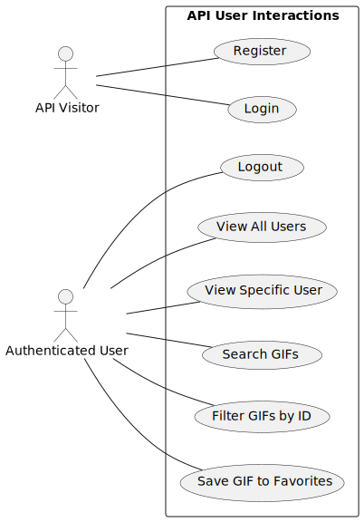
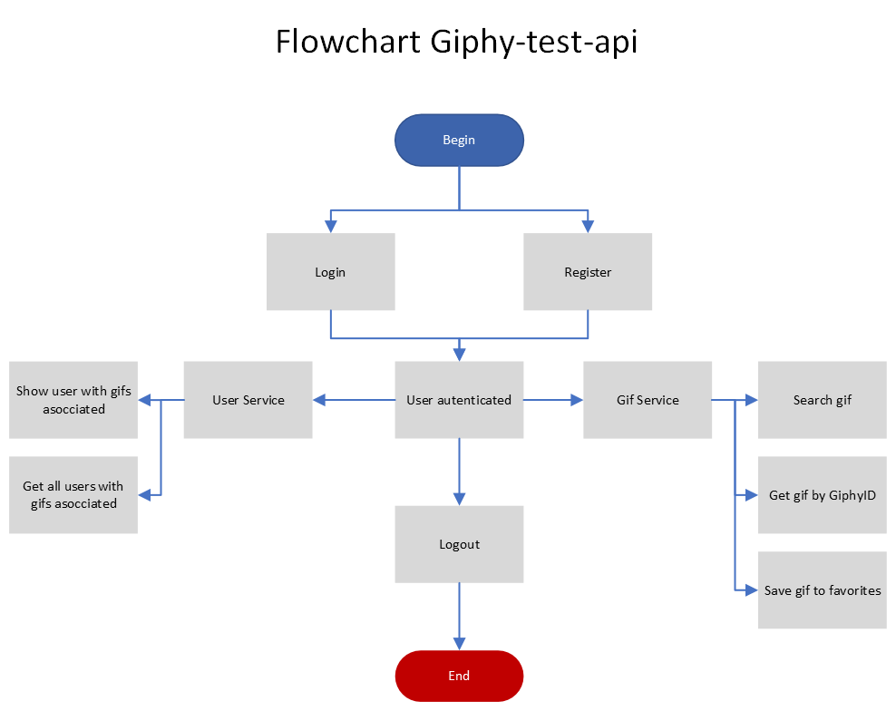
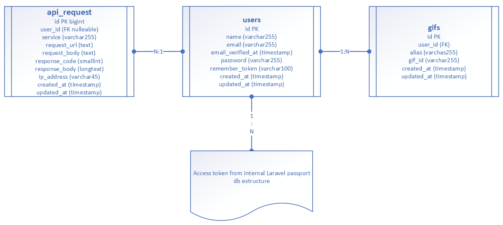

## Giphy API test

## Core:

* PHP 8.2.11 with Laravel v10 - <a href="https://laravel.com" target="_blank">Official Laravel documentation</a>
* MySQL 8.0
* Nginx
* Docker

## Installation

1. Clone the repository
2. Copy the .env.example file to .env
3. Run all dockerfiles with `docker-compose build`
4. Run the containers with `docker-compose up -d`
5. Enter the php container with `docker exec -it giphy-test-php-1 bash`
6. Run the tests with `php artisan test`

## Uses cases

## Flowchart

## ERD (Entity Relationship Diagram)

## API Endpoints
You can see the API documentation in the following link:
<a href="https://elements.getpostman.com/redirect?entityId=29049429-6937f0bb-4739-4078-ab7e-f90fca43e0c8&entityType=collection" target="_blank">Giphy API documentation & Collection</a>

You can import the Postman collection from the following link:
<a href="https://api.postman.com/collections/29049429-6937f0bb-4739-4078-ab7e-f90fca43e0c8?access_key=PMAT-01HVVZR13FE21Q9HVWQT97NRE0" target="_blank">Giphy API Postman collection</a>

